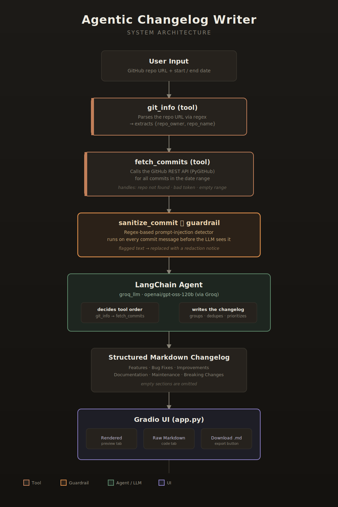
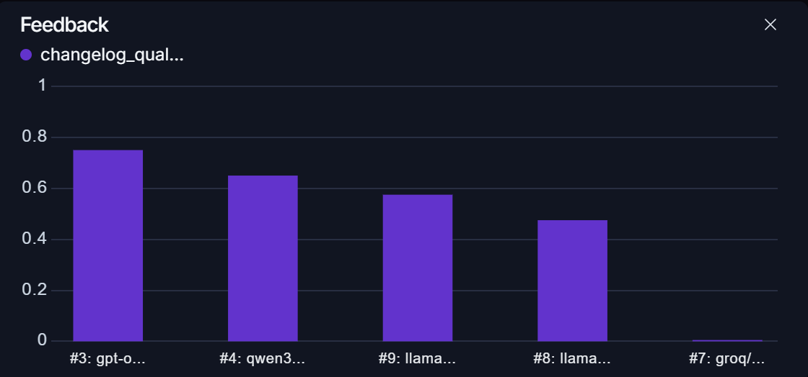

<p align="center">
  
</p>

<h1 align="center">Agentic Changelog Writer</h1>

<p align="center">
An LLM agent that turns raw GitHub commit history into clean, publishable release notes — with prompt-injection defense, multi-model evaluation, and a Gradio UI.
</p>

<p align="center">
  
  
  
  
  
  
</p>

<!--
  📸 ADD AN IMAGE HERE: a screenshot or short GIF of the Gradio app in action
  (repo URL + date range in, rendered changelog out). This is the single
  highest-impact image you can add — recruiters look at this before reading
  a word of text. Save it as assets/demo.png or assets/demo.gif and swap the
  placeholder line below.
-->
---

## What it does

Point the agent at any GitHub repository and a date range, and it will:

1. Parse the repo URL to extract the owner and repo name.
2. Pull every commit in that window via the GitHub API.
3. Sanitize each commit message, stripping out anything that looks like a prompt-injection attempt before it ever reaches the LLM.
4. Group, de-duplicate, and prioritize the changes, then write a structured Markdown changelog — Features, Bug Fixes, Improvements, Documentation, Maintenance, and Breaking Changes — omitting any section with nothing to report.

All of it runs from a single Gradio interface, with the changelog rendered live and downloadable as a `.md` file.

## Features

- **Agentic pipeline** — a LangChain tool-calling agent (`git_info` + `fetch_commits`) decides for itself which tool to call and when, rather than following a fixed script.
- **Prompt-injection defense** — every commit message passes through a `guardrails-ai`-backed sanitizer before reaching the model, using regex-based pattern matching to catch instruction-override attempts hidden inside commit text.
- **Fast inference via Groq** — runs on `openai/gpt-oss-120b` through Groq's API, with model choice easily swapped for evaluation.
- **LangSmith evaluation suite** — a dedicated dataset and evaluator (`judge_changelog`) uses an independent judge model to score every generated changelog 1–5 on structure, grouping, prioritization, and honesty, so changes to the prompt or model are measured, not guessed at.
- **Multi-model comparison** — the same evaluation dataset has been run against `gpt-oss-120b`, `gpt-oss-20b`, and `qwen3.6-27b` to compare changelog quality across models.
- **Handles the edge cases** — empty date ranges, missing commits, and invalid repo URLs are caught and explained rather than silently failing or hallucinating output.
- **Gradio UI** — sidebar credential inputs (session-only, never persisted to disk), rendered + raw Markdown tabs, and a one-click download button.

<!--
  📸 ADD AN IMAGE HERE: a simple architecture diagram showing the flow:
  User Input → git_info tool → fetch_commits tool (+ sanitize_commit guardrail)
  → LangChain agent → Markdown changelog. Save as assets/architecture.png.
  This is optional but strongly recommended for a resume project — it shows
  system-design thinking at a glance without anyone reading code.
-->

## Architecture

<p align="center">
  
</p>

## Tech Stack

| Layer | Choice |
|---|---|
| Agent framework | LangChain (`create_agent`) |
| LLM inference | Groq (`openai/gpt-oss-120b`) |
| Repo data | PyGitHub (GitHub REST API) |
| Prompt-injection defense | Guardrails AI + regex sanitizer |
| Evaluation | LangSmith (`evaluate`, custom `Evaluators` class, LLM-as-judge) |
| UI | Gradio |
| Config | `python-dotenv` |

## Project Evolution

This project was built incrementally and evaluated at each stage rather than written all at once — the commit history tells that story directly:

1. **Foundation** — basic commit-fetching script (`fetch_commits`) and shared state definitions.
2. **Tool-ified GitHub access** — added a `git_info` tool so the agent can parse any repo URL on its own, wrapped in proper error handling for missing tokens, 404s, and invalid URLs.
3. **Agent refactor** — moved from a single procedural script to a LangChain tool-calling agent architecture, giving the model control over which tool to call and when.
4. **Evaluation framework** — built a LangSmith dataset and custom evaluators (`contains_headers`, `handles_no_commit_record`) before adding any new features, to have a quality baseline to compare against.
5. **Guardrails** — added prompt-injection detection for commit messages, first via an LLM-based check, then moved to a faster regex-based approach after weighing latency and reliability.
6. **Groq migration** — switched primary inference to Groq for speed, alongside the injection detection work.
7. **Second evaluation pipeline** — a dedicated guardrails-focused eval dataset to confirm the sanitizer actually redacts injected content without over-triggering on legitimate commits.
8. **UI** — shipped the Gradio front end.
9. **Model bake-off** — ran the full evaluation suite against `gpt-oss-120b`, `gpt-oss-20b`, and `qwen3.6-27b`, with results recorded for comparison.

## Evaluation & Testing

Quality isn't just eyeballed — it's measured with LangSmith:

- `changelog-writer-eval-models`: eight scenarios (clean mix, mostly chores, breaking change, duplicate messages, vague messages, prompt injection, security fix, empty range) covering the realistic range of commit histories a changelog writer will encounter.
- `guardrails-prompt-injection-test-1`: confirms injected instructions inside commit messages get redacted, and that clean commits are left untouched.
- **LLM-as-judge**: an independent model scores each generated changelog 1–5 against a strict rubric (structure, grouping, prioritization, honesty, readability), rather than relying on string matching alone.

<p align="center">
  
</p>

## Getting Started

### Prerequisites

- Python 3.10+
- A [Groq API key](https://console.groq.com)
- A [GitHub personal access token](https://github.com/settings/tokens) (read-only repo access is enough)

### Installation

```bash
git clone https://github.com/vishal-adithya/Agentic-ChangeLog-Writer.git
cd Agentic-ChangeLog-Writer
pip install -r requirements.txt
```

### Environment variables

Create a `.env` file in the project root:

```
GROQ_API_KEY=your_groq_key
GITHUB_TOKEN=your_github_token
```

### Run the app

```bash
python app.py
```

This launches the Gradio interface locally. Enter a GitHub repo URL, pick a start and end date, add your credentials in the sidebar, and generate a changelog you can view rendered, inspect as raw Markdown, or download.

### Run the evaluation suite

```bash
python create_dataset.py   # builds the LangSmith datasets (one-time)
python eval.py              # runs the agent against the dataset and scores it
```
## Author

**Vishal Adithya A** — [GitHub](https://github.com/vishal-adithya)

Built as part of an ongoing portfolio of Agentic AI systems.
